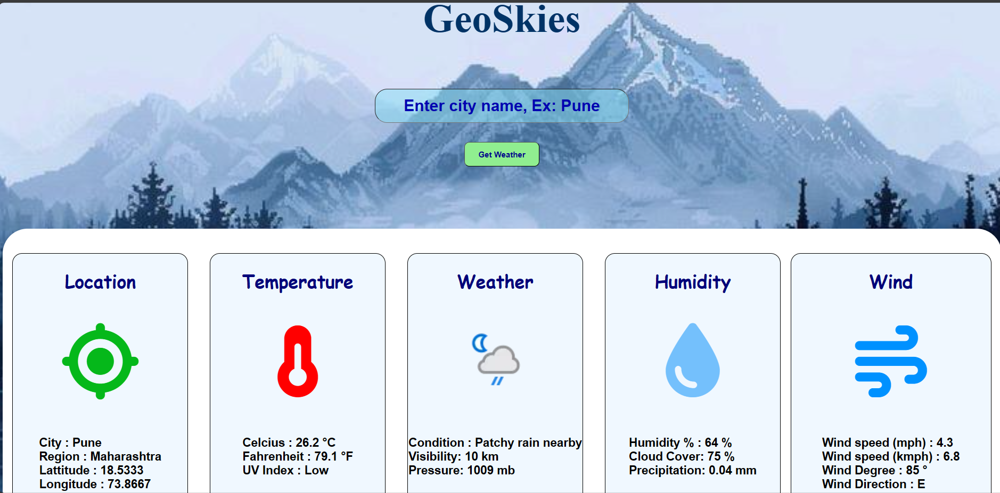

## 🌦️ Weather App
A sleek, responsive weather application built using **HTML**, **CSS**, and **JavaScript**, powered by the **OpenWeatherMap API**. Users can search any city to view real-time weather conditions including temperature, humidity, wind speed, and dynamic weather icons.

---

### 🔍 Features
1) 🔎 City-based weather search  
2) 🌡️ Displays temperature, humidity, and wind speed  
3) 🌤️ Dynamic weather icons  

---

### 🚀 How It Works
- Uses `fetch()` to retrieve weather data from OpenWeatherMap API  
- Parses JSON response and updates the DOM dynamically  
- Applies conditional styling based on weather conditions

---

### 📸 Screenshots
> 

---

### 📚 What I Learned
- API integration and asynchronous JavaScript  
- DOM manipulation and event-driven programming  
- UI/UX design principles for responsive layouts

---

### 🛠️ Future Enhancements
- 🌍 Geolocation-based weather detection  
- 🔁 Unit toggle: Celsius ↔ Fahrenheit  
- 🌘 Light/Dark mode toggle  
- 🕒 Hourly and weekly forecast view

---